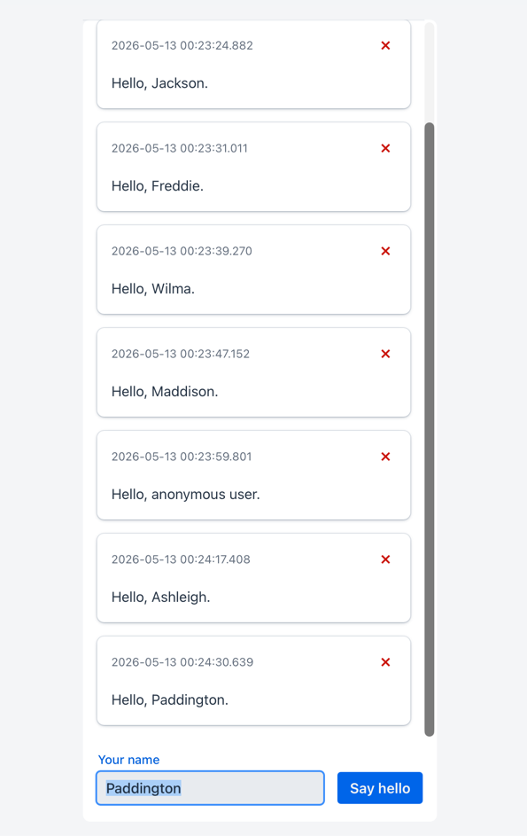
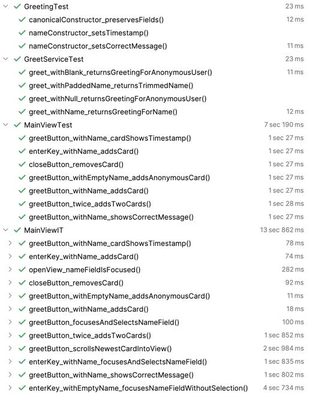

# Testing Showcase

A Vaadin application demonstrating both Browserless and TestBench testing along with best practices for each.

The two testing approaches complement each other: **browserless unit tests**, which run the UI entirely in the JVM with no browser or server, and **TestBench end-to-end tests**, which drive a real Chrome browser. In this showcase, tests of the two suites overlap each other — in practice that would not be desirable. Seven cases both implement would normally live only in the faster browserless suite, and the IT suite would cover only the five cases that require a real browser. They are implemented both ways here only so you can compare their structure side by side.

Both suites are built around page objects — classes that encapsulate the logic to locate and interact with UI components. Tests stay concise and focused because they express what to do, not how to find what to do it to; a UI change requires updating only the page object rather than every test that uses it. Each view and component has its own dedicated page object so concerns stay at the right level. All page objects follow the same structure — public API, internal accessors, helpers — so any one of them is immediately navigable. Methods return the resulting object directly, enabling fluent test expressions, and accessor names make return types self-evident at the call site.

The integration test setup has a liberating feature worth calling out. Tests can be run directly from an IDE without manual app server startup/shutdown or dev app server port collision — shim classes handle what Maven's build lifecycle provides automatically, including server management and IT concurrency configuration.

---

## The Application

A greeting app where users type a name and click **Say hello** (or press Enter). Each greeting appears as a card with a timestamp and a close button. Cards accumulate in a scrollable list, automatically scrolling the newest card into view.

The name field is focused when the view opens. After each greeting, the name field regains focus with its text selected, so the user can immediately type a new name.



### Application Project Structure

```
src/main/java/com/example/application/
├── model/
│   └── Greeting.java            # Record: message + timestamp
├── service/
│   └── GreetService.java        # Resolves name, returns Greeting
├── ui/
│   ├── component/
│   │   └── GreetingCard.java    # Composite<Card>: displays a Greeting
│   └── view/
│       └── MainView.java        # Root view: scrollable cards + input area
└── AppShell.java
```

### Running the Application

- **Maven:** `mvn jetty:run`
- **IDE:** This is a WAR-based app with no main class. In IntelliJ, open the Maven tool window and double-click Plugins → jetty → `jetty:run`, or create a Maven run configuration for the `jetty:run` goal.

Opens at [http://localhost:8080](http://localhost:8080).

---

## Testing

This showcase application demonstrates both browserless unit testing and browser-based end-to-end integration testing.

### Unit Tests

#### Running the Unit Tests

- **Maven:** `mvn test`
- **IDE:** Run `MainViewTest` (or the entire `ut` package) directly

No browser, server, or special configuration needed.

There are two groups of unit tests:

#### Plain JUnit — for model and service

```
src/test/java/com/example/application/
└── ut/
    ├── model/
    │   └── GreetingTest.java        # Tests the Greeting record
    └── service/
        └── GreetServiceTest.java    # Tests GreetService name resolution
```

These are standard JUnit 6 tests with no Vaadin machinery involved.

#### Browserless — for UI logic

```
src/test/java/com/example/application/
└── ut/
    └── ui/
        ├── component/
        │   └── GreetingCardTester.java    # Page object (ComponentTester)
        └── view/
            ├── MainViewTester.java        # Page object (ComponentTester)
            └── MainViewTest.java          # Browserless tests
```

`MainViewTest` extends `BrowserlessTest` (from `browserless-test-junit6`). Vaadin's test environment instantiates the UI, session, and routes in the JVM — no browser, no HTTP. Tests call `navigate(MainView.class)` to get a view instance, then interact through the page objects.

Unit tests run in parallel. `ThreadLocal` is used for all session and UI state, so concurrent test methods are fully isolated. The default parallelism size is set to `32` by the `unit-test.concurrent-limit` POM property. Override at the command line: `-Dunit-test.concurrent-limit=N`.

The suite covers button clicks, the Enter key shortcut, empty-name handling, card message and timestamp content, and card removal — 7 test cases in total.

### Integration Tests

#### Running the Integration Tests

Requires Chrome.

- **Maven:** `mvn verify -Pit` — Jetty starts before the tests and stops after.
- **IDE:** Run `MainViewIT` directly. `ServerExtension` starts Jetty automatically if it is not already running, so no manual server setup is needed. `TestBenchParallelLimiter` configures the browser parallelism limit via the JUnit SPI hook before the executor starts — no VM options required unless overriding the default.

```
src/test/java/com/example/application/
└── it/
    ├── ServerExtension.java               # JUnit extension: starts embedded Jetty when not already running
    ├── TestBenchParallelLimiter.java      # JUnit SPI hook: sets TestBench parallelism before executor setup
    └── ui/
        ├── component/
        │   └── GreetingCardElement.java   # Page object (TestBenchElement)
        └── view/
            ├── MainViewElement.java       # Page object (TestBenchElement)
            └── MainViewIT.java            # TestBench e2e tests
```

`MainViewIT` extends `BrowserTestBase`. Tests open the app in a real browser and interact through the page objects.

`BrowserTestBase` enables JUnit 6 parallel execution automatically — multiple Chrome instances open concurrently. The concurrent browser limit defaults to 8, controlled by the `integration-test.concurrent-limit` POM property. Override at the Maven command line: `-Dintegration-test.concurrent-limit=N`. To override from an IDE run, set `integration-test.concurrent-limit` in `it-test.properties` — `TestBenchParallelLimiter` reads it automatically before TestBench captures the value.

TestBench page objects extend `TestBenchElement` and are annotated with `@Element("tag-name")`. They expose the same high-level API as the browserless page objects — same method names, different implementation. Internally they use `$(ElementType.class)` to query the live DOM.

The suite covers the same 7 cases as the browserless suite, plus 5 that require a real browser:

#### Browser-Only Tests

- **Focus and selection** — four tests verify that the name field is focused on view open, that it is focused with its text selected after clicking the button or pressing Enter with a name entered, and that it is focused without selection after pressing Enter with an empty name. Browserless tests have no concept of browser focus or text selection.
- **Scroll visibility** — `greetButton_scrollsNewestCardIntoView` adds cards until the first card scrolls out of view (adapting to actual window size rather than a hardcoded count), then uses `waitUntil()` to confirm the newest card is in the visible area. Scroll position is checked via `TestBenchElement.getRect()`.

#### Non-Conflicting Deployment Port

Running `mvn verify -Pit` while a development instance is already serving on 8080 would normally fail — the second Jetty cannot bind a port that is already in use. These IT tests deploy to port 9090 by default so that the test suite and a live dev instance can run at the same time.

The port is controlled by the `it-deployment.port` POM property (default `9090`), which flows to three places: the Jetty plugin's `<httpConnector><port>` (the port Maven binds), Failsafe's `<systemPropertyVariables>` as the `deployment.port` system property (injected into the forked test JVM and read by both `ServerExtension` and `MainViewIT`), and `it-test.properties` via Maven resource filtering (read by `ServerExtension` on IDE runs, which then sets the `deployment.port` system property itself so `MainViewIT` can read it the same way in both environments). Override at the command line: `-Dit-deployment.port=N`.

#### Shared Embedded Jetty — `ServerExtension`

`ServerExtension` shims the Maven build lifecycle for IDE runs: `mvn verify -Pit` starts and stops Jetty automatically; this extension does the same when no server is detected, and reference-counts across concurrent test classes to prevent race conditions.

#### JUnit SPI Hook for Early Parallelism Configuration — `TestBenchParallelLimiter`

`TestBenchParallelLimiter` shims Failsafe's `<systemPropertyVariables>` for IDE runs: Maven injects the parallelism limit before the forked JVM starts; this SPI listener does the same before JUnit's executor is configured.

---

## Page Object Design

Both page object families follow the same structural conventions.

### Three-section layout

Each page object class is divided into three sections:

- **Browserless**

```java
// PUBLIC API                          — methods called directly by tests
// INTERNAL component tester accessors — private methods that locate and wrap components
// INTERNAL helpers                    — private methods that combine accessors into operations
```

- **TestBench**

```java
// PUBLIC API                          — methods called directly by tests
// INTERNAL element accessors          — private methods that locate DOM elements
// INTERNAL helpers                    — private methods that combine accessors into operations
```

This keeps the public surface clean and makes component lookups easy to find and update in one place.

### Accessor return types

Internal accessor methods are named and typed to match what they actually return — a `Tester` or `Element` suffix signals that the method returns a testing wrapper, not the raw component:

```java
// Browserless — internal accessors return tester types
private TextFieldTester<TextField, String> getNameTextFieldTester() { ... }
private ButtonTester<Button>              getGreetButtonTester()    { ... }
private SpanTester                        getTimestampSpanTester()  { ... }
private DivTester                         getMessageDivTester()     { ... }

// TestBench — internal accessors return element types
private TextFieldElement getNameTextFieldElement() { ... }
private ButtonElement    getGreetButtonElement()   { ... }
private SpanElement      getTimestampSpanElement() { ... }
private DivElement       getMessageDivElement()    { ... }
```

This prevents confusion when reading the code — a method named `getNameTextField()` that returns a `TextFieldTester` would be misleading.

### User input via Tester and Element APIs

All user interactions in the tests go through the appropriate testing abstraction — never through direct component state manipulation:

```java
// Browserless — TextFieldTester.setValue() checks usability before setting
getNameTextFieldTester().setValue(name);   // not: textField.setValue(name)
getGreetButtonTester().click();            // not: componentTester.click()

// TestBench — click() + sendKeys() simulates real typing (leaves no pre-existing selection)
getNameTextFieldElement().click();
getNameTextFieldElement().sendKeys(name);  // not: textFieldElement.setValue(name)
```

This matters for correctness: `TextFieldElement.setValue()` in TestBench leaves text selected as a side effect, which would mask the absence of the autoselect behavior being tested.

### Stable element location

Components are located by type combined with their own attributes, rarely by type alone:

```java
// Browserless
find(TextField.class).withCaption("Your name").single()
find(Button.class).withText("Say hello").single()

// TestBench
$(TextFieldElement.class).withCaption("Your name").single()
$(ButtonElement.class).withText("Say hello").single()
```

This prevents tests from breaking when additional components of the same type are added to the view.

### Method chaining

`greet()` and `clickGreetButton()` return the newly added card, enabling fluent test expressions:

```java
assertEquals("Hello, Alice.", view.greet("Alice").getMessage());
view.greet("Alice").close();
```

### Separation of concerns

Visibility relative to the scroller is a concern of the view, not the card. `isCardVisible(GreetingCardElement)` lives on `MainViewElement` so that `GreetingCardElement` only knows about its own content.

---

## Similarities Between Both Approaches

| | Browserless (`MainViewTest`) | TestBench (`MainViewIT`) |
|---|---|---|
| Page object base | `ComponentTester<T>` | `TestBenchElement` |
| Internal accessor types | `TextFieldTester`, `ButtonTester`, `SpanTester`, `DivTester` | `TextFieldElement`, `ButtonElement`, `SpanElement`, `DivElement` |
| Public method names | `greet()`, `setName()`, `getMessage()`, `getTimestamp()`, `close()`, … | same core methods, plus browser-only additions |
| Test cases | 7 shared cases | 7 shared + 5 browser-only |
| Element location | `find().withCaption()/withText()` | `$().withCaption()/withText()` |
| Run with | `mvn test` | `mvn verify -Pit` |
| Needs browser | no | yes (Chrome) |
| Needs server | no | yes (Jetty on 9090) |
| Speed | ~milliseconds | ~seconds |

---

## Key Differences

**Browserless tests** run entirely server-side. They are fast, reliable (no Selenium timing issues), and run in CI without a display. They verify server-side logic — component state, event handling, listener behavior.

**TestBench e2e tests** drive a real browser. They are slower but verify the full stack — HTML rendering, CSS, web component behavior, and browser APIs like scroll position. Some behaviors (smooth scrolling, focus, hover states) can only be tested this way.

Both approaches use page objects with the same core API, so the shared test cases are structurally identical — compare `MainViewTest` and `MainViewIT` side by side to see this clearly.

---

## Test Timings

These are IntelliJ's per-test elapsed times. The class-level totals are sums of those per-test numbers, not wall-clock — tests within each suite run concurrently, so `mvn test` finishes all 14 unit tests in about 1 second and `mvn verify -Pit` finishes the 12 IT tests in about 9 seconds.

**Plain JUnit** (`GreetingTest`, `GreetServiceTest`) is essentially free — 46 ms total for 7 tests. No Vaadin machinery, just constructing data objects.

**Browserless** (`MainViewTest`) is strikingly uniform: every test reports ~1 s 27 ms, regardless of what it does. The work in each test body is trivial, so the ~1 second is mostly Vaadin's one-time bootstrap — Lookup service, route registry, frontend scanning — paid once per JVM but blocking every test until it completes, because they all start in parallel and contend on the first-time class initialization. Run a single browserless test on its own and it costs about the same; run many, and the cost barely grows.

**TestBench** (`MainViewIT`) varies wildly — from 11 ms to 4 s 734 ms. The fast tests (sub-100 ms) are not magic: JUnit's per-test timer excludes `@BeforeEach`, so the cost of starting Chrome and loading the page lands outside the reported number, and what remains is a few DOM operations against an already-warm driver. The slow tests are either ones that explicitly wait for asynchronous browser state (the focus-and-selection group uses `waitUntil`) or whichever test happened to be the first scheduled on its worker thread and paid the browser-launch cost inside the measured window.

**The unexpected result**: several IT tests are reported as *faster* than any browserless test. That seems to contradict the per-test "~milliseconds vs ~seconds" line in the comparison table above, but they're measuring different things — the table is the typical wall-clock cost of a suite, while this view is the per-test elapsed time as JUnit defines it. Browserless still wins on wall-clock because all 7 tests overlap inside ~1 second of bootstrap, whereas the IT suite's 8-concurrent cap and 13.9 s of summed work compress to roughly 9 s.


